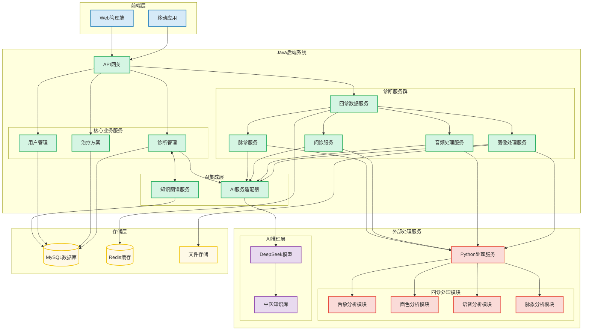
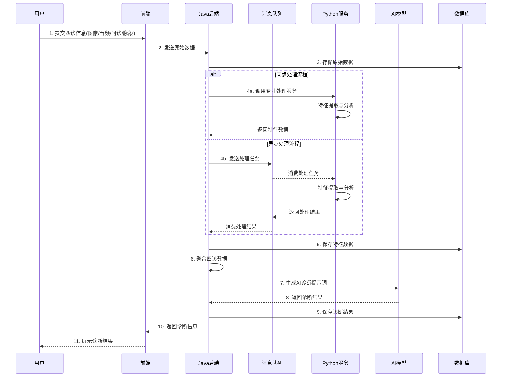
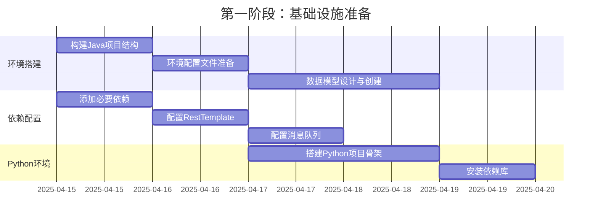
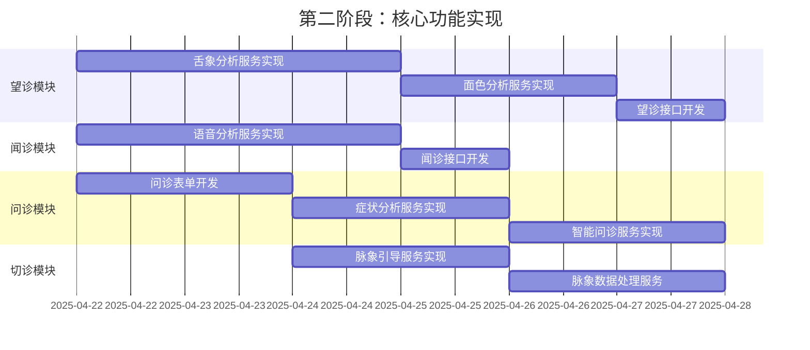
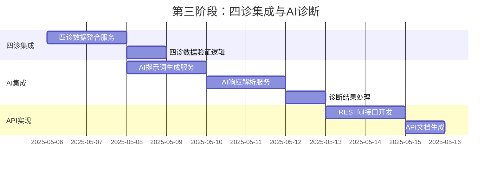
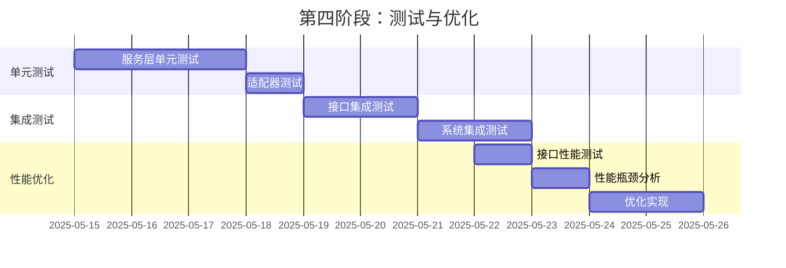
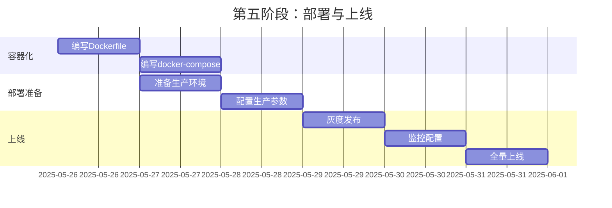

# 中医四诊数字化系统与Java后端集成方案

## 一、总体架构设计

要将中医四诊数字化方案与您的Java系统（MeridianMind）集成，需要考虑系统间的交互边界、数据流向和技术栈兼容性。

### 1.1 集成架构图



### 1.2 集成方式选择

根据技术特点，我们采用**混合集成方式**:

1. **Java主导，Python辅助**: Java作为主系统，Python作为专业处理服务
2. **HTTP+gRPC通信**: 系统间采用双模式通信，提高性能与稳定性
3. **消息队列解耦**: 处理异步任务，提高系统韧性
4. **统一数据模型**: 在系统间建立统一的数据交换标准

## 二、技术方案设计

### 2.1 技术栈选择

| 层级         | 技术选择                          | 说明                     |
| ------------ | --------------------------------- | ------------------------ |
| Java后端     | Spring Boot + MyBatis-Plus        | 符合现有系统技术栈       |
| 通信框架     | Spring Cloud + OpenFeign + gRPC   | 兼顾REST和高性能RPC      |
| 消息队列     | RabbitMQ                          | 处理异步任务和系统间解耦 |
| 图像处理接口 | Spring Integration + RestTemplate | 与Python服务交互         |
| Python服务   | FastAPI                           | 高性能Python Web框架     |
| 容器化       | Docker + Docker Compose           | 简化部署与环境一致性     |

### 2.2 数据流设计



## 三、系统集成详细方案

### 3.1 Java系统架构调整

首先需要在现有Java系统中添加四诊服务模块:

```java
// 项目结构调整
src/main/java/cn/medapp/meridianmind/
├── common/           # 通用工具类和常量
├── config/           # 配置类
├── controller/       # 控制器
├── domain/           # 领域模型
│   ├── entity/       # 数据库实体
│   ├── vo/           # 视图对象
│   └── dto/          # 数据传输对象
├── repository/       # 数据访问层
├── service/          # 服务层
│   ├── impl/         # 服务实现
│   └── convert/      # 对象转换
├── ai/               # AI相关组件
│   ├── model/        # 模型交互
│   └── knowledge/    # 知识图谱
│
│── fourdiagnosis/    # 【新增】四诊服务模块
│   ├── inspection/   # 望诊服务
│   ├── auscultation/ # 闻诊服务
│   ├── inquiry/      # 问诊服务
│   ├── palpation/    # 切诊服务
│   ├── adapter/      # Python服务适配器
│   ├── dto/          # 四诊数据传输对象
│   └── integration/  # 四诊数据集成服务
│
└── MeridianMindApplication.java   # 启动类
```

### 3.2 四诊模块核心接口设计

创建四个核心服务接口:

```java
// 1. 望诊服务接口
public interface InspectionService {
    /**
     * 处理舌象图像并提取特征
     */
    TongueFeatureDTO processTongueImage(MultipartFile tongueImage);
    
    /**
     * 处理面色图像并提取特征
     */
    FacialFeatureDTO processFacialImage(MultipartFile facialImage);
    
    /**
     * 保存望诊数据
     */
    InspectionDTO saveInspectionData(Long diagnosticId, InspectionDTO inspectionData);
}

// 2. 闻诊服务接口
public interface AuscultationService {
    /**
     * 处理语音并提取特征
     */
    VoiceFeatureDTO processVoiceAudio(MultipartFile audioFile);
    
    /**
     * 保存闻诊数据
     */
    AuscultationDTO saveAuscultationData(Long diagnosticId, AuscultationDTO auscultationData);
}

// 3. 问诊服务接口
public interface InquiryService {
    /**
     * 分析症状文本并提取结构化信息
     */
    SymptomAnalysisDTO analyzeSymptomText(String symptomText);
    
    /**
     * 保存问诊数据
     */
    InquiryDTO saveInquiryData(Long diagnosticId, InquiryDTO inquiryData);
    
    /**
     * 获取智能问诊问题
     */
    List<QuestionDTO> getNextQuestions(Long diagnosticId, String currentSymptom);
}

// 4. 切诊服务接口
public interface PalpationService {
    /**
     * 保存脉象数据
     */
    PalpationDTO savePalpationData(Long diagnosticId, PalpationDTO palpationData);
    
    /**
     * 获取脉象参考数据
     */
    List<PulseReferenceDTO> getPulseReferenceData();
}

// 5. 四诊集成服务
public interface FourDiagnosesService {
    /**
     * 整合四诊数据
     */
    IntegratedDiagnosticDataDTO integrateFourDiagnoses(Long diagnosticId);
    
    /**
     * 生成AI诊断提示词
     */
    String generateAiPrompt(IntegratedDiagnosticDataDTO integratedData);
    
    /**
     * 获取AI诊断结果
     */
    DiagnosisResultDTO getDiagnosisResult(Long diagnosticId);
}
```

### 3.3 数据模型设计

为四诊系统定义主要数据模型:

```java
// 1. 舌象特征DTO
@Data
public class TongueFeatureDTO {
    private String tongueColor;      // 舌质颜色
    private String tongueCoating;    // 舌苔特征
    private String tongueShape;      // 舌形特征
    private boolean hasCrack;        // 是否有裂纹
    private boolean hasToothMark;    // 是否有齿痕
    private double moisture;         // 湿润度
    private String imageUrl;         // 图像URL
    private Map<String, Object> rawFeatures; // 原始特征数据
}

// 2. 面色特征DTO
@Data
public class FacialFeatureDTO {
    private String faceColor;        // 面色
    private double colorSaturation;  // 色彩饱和度
    private double colorBrightness;  // 色彩亮度
    private Map<String, Object> regionColors; // 各区域面色
    private String imageUrl;         // 图像URL
    private Map<String, Object> rawFeatures; // 原始特征数据
}

// 3. 语音特征DTO
@Data
public class VoiceFeatureDTO {
    private String strength;         // 声音强度
    private String tone;             // 音调
    private String rhythm;           // 节奏
    private String breathPattern;    // 呼吸特点
    private String audioUrl;         // 音频URL
    private Map<String, Object> rawFeatures; // 原始特征数据
}

// 4. 问诊结构化数据DTO
@Data
public class InquiryDTO {
    private String chiefComplaint;   // 主诉
    private List<SymptomDTO> symptoms; // 症状列表
    private String onset;            // 发病时间
    private String duration;         // 持续时间
    private List<String> aggravatingFactors; // 加重因素
    private List<String> relievingFactors;   // 缓解因素
    private Map<String, String> additionalInfo; // 额外信息
}

// 5. 脉象数据DTO
@Data
public class PalpationDTO {
    private Map<String, PulsePositionDTO> leftHand; // 左手脉象
    private Map<String, PulsePositionDTO> rightHand; // 右手脉象
    private String overallPulse;     // 整体脉象特点
    private Map<String, Object> additionalFindings; // 额外发现
}

// 6. 整合的四诊数据DTO
@Data
public class IntegratedDiagnosticDataDTO {
    private Long diagnosticId;       // 诊断ID
    private InspectionDTO inspection;    // 望诊数据
    private AuscultationDTO auscultation; // 闻诊数据
    private InquiryDTO inquiry;      // 问诊数据
    private PalpationDTO palpation;  // 切诊数据
}
```

### 3.4 Python处理服务架构

为四诊分析创建Python微服务:

```
四诊处理服务/
├── app/
│   ├── __init__.py
│   ├── main.py                  # FastAPI主程序
│   ├── core/
│   │   ├── __init__.py
│   │   ├── config.py            # 配置管理
│   │   └── logger.py            # 日志处理
│   ├── api/
│   │   ├── __init__.py
│   │   ├── endpoints/
│   │   │   ├── __init__.py
│   │   │   ├── tongue.py        # 舌象分析API
│   │   │   ├── face.py          # 面色分析API
│   │   │   ├── voice.py         # 语音分析API
│   │   │   └── pulse.py         # 脉象引导API
│   │   └── deps.py              # 依赖项
│   ├── services/
│   │   ├── __init__.py
│   │   ├── tongue_analyzer.py   # 舌象分析服务
│   │   ├── face_analyzer.py     # 面色分析服务
│   │   ├── voice_analyzer.py    # 语音分析服务
│   │   └── pulse_guide.py       # 脉象引导服务
│   ├── models/
│   │   ├── __init__.py
│   │   └── schemas.py           # 数据模型
│   └── utils/
│       ├── __init__.py
│       ├── image_utils.py       # 图像处理工具
│       └── audio_utils.py       # 音频处理工具
├── requirements.txt
├── Dockerfile
└── docker-compose.yml
```

Python服务主程序示例:

```python
# app/main.py
from fastapi import FastAPI
from fastapi.middleware.cors import CORSMiddleware

from app.api.endpoints import tongue, face, voice, pulse
from app.core.config import settings

app = FastAPI(
    title="中医四诊数字化处理服务",
    description="提供舌象分析、面色分析、语音分析和脉象引导服务",
    version="1.0.0"
)

# 添加CORS中间件
app.add_middleware(
    CORSMiddleware,
    allow_origins=settings.ALLOWED_ORIGINS,
    allow_credentials=True,
    allow_methods=["*"],
    allow_headers=["*"],
)

# 挂载API路由
app.include_router(tongue.router, prefix="/api/tongue", tags=["舌象分析"])
app.include_router(face.router, prefix="/api/face", tags=["面色分析"])
app.include_router(voice.router, prefix="/api/voice", tags=["语音分析"])
app.include_router(pulse.router, prefix="/api/pulse", tags=["脉象引导"])

@app.get("/")
def read_root():
    return {"message": "中医四诊数字化处理服务正在运行"}
```

舌象分析端点示例:

```python
# app/api/endpoints/tongue.py
from fastapi import APIRouter, UploadFile, File, HTTPException
from app.services.tongue_analyzer import TongueAnalyzer
import io

router = APIRouter()
tongue_analyzer = TongueAnalyzer()

@router.post("/analyze")
async def analyze_tongue_image(file: UploadFile = File(...)):
    """
    分析舌象图像并返回特征数据
    """
    try:
        # 读取上传的图像
        contents = await file.read()
        
        # 调用舌象分析服务
        features = tongue_analyzer.analyze_image(io.BytesIO(contents))
        
        return {
            "success": True,
            "data": features
        }
    except Exception as e:
        raise HTTPException(status_code=500, detail=f"舌象分析失败: {str(e)}")
```

### 3.5 Java与Python服务集成

在Java系统中创建与Python服务通信的适配器:

```java
// 1. 舌象分析服务适配器
@Service
@Slf4j
public class TongueAnalysisAdapter {
    
    @Value("${python.service.url}/api/tongue/analyze")
    private String tongueAnalysisUrl;
    
    private final RestTemplate restTemplate;
    
    @Autowired
    public TongueAnalysisAdapter(RestTemplate restTemplate) {
        this.restTemplate = restTemplate;
    }
    
    /**
     * 发送舌象图像并获取分析结果
     */
    public TongueFeatureDTO analyzeTongueImage(MultipartFile tongueImage) {
        try {
            // 构建请求体
            HttpHeaders headers = new HttpHeaders();
            headers.setContentType(MediaType.MULTIPART_FORM_DATA);
            
            MultiValueMap<String, Object> body = new LinkedMultiValueMap<>();
            body.add("file", new MultipartInputStreamFileResource(
                    tongueImage.getInputStream(), 
                    tongueImage.getOriginalFilename()
            ));
            
            HttpEntity<MultiValueMap<String, Object>> requestEntity = 
                    new HttpEntity<>(body, headers);
            
            // 发送请求
            ResponseEntity<Map> response = restTemplate.postForEntity(
                    tongueAnalysisUrl, 
                    requestEntity, 
                    Map.class
            );
            
            if (response.getStatusCode().is2xxSuccessful() && response.getBody() != null) {
                if (Boolean.TRUE.equals(response.getBody().get("success"))) {
                    // 解析响应数据
                    Map<String, Object> data = (Map<String, Object>) response.getBody().get("data");
                    return mapToTongueFeatureDTO(data);
                }
            }
            
            throw new ServiceException("舌象分析服务返回失败");
        } catch (Exception e) {
            log.error("舌象分析失败", e);
            throw new ServiceException("舌象分析处理异常: " + e.getMessage());
        }
    }
    
    /**
     * 将响应数据映射为DTO对象
     */
    private TongueFeatureDTO mapToTongueFeatureDTO(Map<String, Object> data) {
        TongueFeatureDTO dto = new TongueFeatureDTO();
        
        dto.setTongueColor((String) data.get("tongue_color"));
        dto.setTongueCoating((String) data.get("tongue_coating"));
        dto.setTongueShape((String) data.get("tongue_shape"));
        dto.setHasCrack((Boolean) data.getOrDefault("has_crack", false));
        dto.setHasToothMark((Boolean) data.getOrDefault("has_tooth_mark", false));
        dto.setMoisture((Double) data.getOrDefault("moisture", 0.0));
        
        @SuppressWarnings("unchecked")
        Map<String, Object> rawFeatures = (Map<String, Object>) data.get("raw_features");
        dto.setRawFeatures(rawFeatures);
        
        return dto;
    }
}
```

为其他三诊创建类似适配器，然后实现服务接口:

```java
@Service
@Slf4j
public class InspectionServiceImpl implements InspectionService {

    private final TongueAnalysisAdapter tongueAnalysisAdapter;
    private final FacialAnalysisAdapter facialAnalysisAdapter;
    private final FileStorageService fileStorageService;
    private final InspectionRepository inspectionRepository;
    
    @Autowired
    public InspectionServiceImpl(TongueAnalysisAdapter tongueAnalysisAdapter,
                              FacialAnalysisAdapter facialAnalysisAdapter,
                              FileStorageService fileStorageService,
                              InspectionRepository inspectionRepository) {
        this.tongueAnalysisAdapter = tongueAnalysisAdapter;
        this.facialAnalysisAdapter = facialAnalysisAdapter;
        this.fileStorageService = fileStorageService;
        this.inspectionRepository = inspectionRepository;
    }
    
    @Override
    public TongueFeatureDTO processTongueImage(MultipartFile tongueImage) {
        // 1. 保存图像文件
        String imageUrl = fileStorageService.storeFile(tongueImage, "tongue");
        
        // 2. 调用舌象分析适配器
        TongueFeatureDTO featureDTO = tongueAnalysisAdapter.analyzeTongueImage(tongueImage);
        
        // 3. 设置图像URL
        featureDTO.setImageUrl(imageUrl);
        
        return featureDTO;
    }
    
    @Override
    public FacialFeatureDTO processFacialImage(MultipartFile facialImage) {
        // 与processTongueImage类似，实现面色分析逻辑
        // ...
    }
    
    @Override
    public InspectionDTO saveInspectionData(Long diagnosticId, InspectionDTO inspectionData) {
        // 1. 数据验证
        if (diagnosticId == null) {
            throw new IllegalArgumentException("诊断ID不能为空");
        }
        
        // 2. 转换为实体对象
        Inspection inspection = InspectionConverter.INSTANCE.toEntity(inspectionData);
        inspection.setDiagnosticId(diagnosticId);
        
        // 3. 保存到数据库
        inspection = inspectionRepository.save(inspection);
        
        // 4. 转换回DTO并返回
        return InspectionConverter.INSTANCE.toDTO(inspection);
    }
}
```

### 3.6 四诊数据整合服务

实现四诊数据整合与AI诊断服务:

```java
@Service
@Slf4j
public class FourDiagnosesServiceImpl implements FourDiagnosesService {

    private final InspectionRepository inspectionRepository;
    private final AuscultationRepository auscultationRepository;
    private final InquiryRepository inquiryRepository;
    private final PalpationRepository palpationRepository;
    private final AiModelService aiModelService;
    private final DiagnosisResultRepository diagnosisResultRepository;
    
    @Autowired
    public FourDiagnosesServiceImpl(
            InspectionRepository inspectionRepository,
            AuscultationRepository auscultationRepository,
            InquiryRepository inquiryRepository,
            PalpationRepository palpationRepository,
            AiModelService aiModelService,
            DiagnosisResultRepository diagnosisResultRepository) {
        this.inspectionRepository = inspectionRepository;
        this.auscultationRepository = auscultationRepository;
        this.inquiryRepository = inquiryRepository;
        this.palpationRepository = palpationRepository;
        this.aiModelService = aiModelService;
        this.diagnosisResultRepository = diagnosisResultRepository;
    }
    
    @Override
    public IntegratedDiagnosticDataDTO integrateFourDiagnoses(Long diagnosticId) {
        // 1. 查询四诊数据
        Inspection inspection = inspectionRepository
                .findByDiagnosticId(diagnosticId)
                .orElse(new Inspection());
                
        Auscultation auscultation = auscultationRepository
                .findByDiagnosticId(diagnosticId)
                .orElse(new Auscultation());
                
        Inquiry inquiry = inquiryRepository
                .findByDiagnosticId(diagnosticId)
                .orElse(new Inquiry());
                
        Palpation palpation = palpationRepository
                .findByDiagnosticId(diagnosticId)
                .orElse(new Palpation());
        
        // 2. 转换为DTO对象
        IntegratedDiagnosticDataDTO integrated = new IntegratedDiagnosticDataDTO();
        integrated.setDiagnosticId(diagnosticId);
        integrated.setInspection(InspectionConverter.INSTANCE.toDTO(inspection));
        integrated.setAuscultation(AuscultationConverter.INSTANCE.toDTO(auscultation));
        integrated.setInquiry(InquiryConverter.INSTANCE.toDTO(inquiry));
        integrated.setPalpation(PalpationConverter.INSTANCE.toDTO(palpation));
        
        return integrated;
    }
    
    @Override
    public String generateAiPrompt(IntegratedDiagnosticDataDTO integratedData) {
        StringBuilder prompt = new StringBuilder();
        
        // 构建结构化的AI提示词
        prompt.append("你是一位经验丰富的中医专家，精通四诊合参和辨证论治。请根据以下四诊信息进行中医辨证分析。\n\n");
        
        // 添加望诊信息
        prompt.append("【望诊信息】\n");
        if (integratedData.getInspection() != null) {
            InspectionDTO inspection = integratedData.getInspection();
            
            if (inspection.getTongue() != null) {
                prompt.append("舌象：舌质")
                      .append(inspection.getTongue().getColor())
                      .append("，舌苔")
                      .append(inspection.getTongue().getCoating())
                      .append("，")
                      .append(inspection.getTongue().hasToothMark() ? "有齿痕，" : "")
                      .append(inspection.getTongue().hasCrack() ? "有裂纹，" : "")
                      .append("\n");
            }
            
            if (inspection.getFace() != null) {
                prompt.append("面色：").append(inspection.getFace().getColor()).append("\n");
            }
        }
        
        // 添加闻诊信息
        // ... 省略其他诊断信息的构建过程
        
        // 添加输出格式要求
        prompt.append("\n请进行详细的辨证分析，并以JSON格式回复，包含以下字段：\n");
        prompt.append("{\n");
        prompt.append("  \"primarySyndrome\": \"主要证型\",\n");
        prompt.append("  \"secondarySyndromes\": [\"次要证型1\", \"次要证型2\"],\n");
        prompt.append("  \"eightPrinciples\": {\n");
        prompt.append("    \"yin_yang\": \"阴证/阳证\",\n");
        prompt.append("    \"exterior_interior\": \"表证/里证\",\n");
        prompt.append("    \"cold_heat\": \"寒证/热证\",\n");
        prompt.append("    \"deficiency_excess\": \"虚证/实证\"\n");
        prompt.append("  },\n");
        prompt.append("  \"diagnosis\": \"详细诊断分析\",\n");
        prompt.append("  \"treatmentPrinciple\": \"治疗原则\",\n");
        prompt.append("  \"recommendedFormulas\": [\"方剂1\", \"方剂2\"],\n");
        prompt.append("  \"lifestyle\": \"生活调养建议\"\n");
        prompt.append("}\n\n");
        prompt.append("请确保分析严格遵循中医理论，特别是《黄帝内经》、《伤寒论》、《金匮要略》等经典理论。");
        
        return prompt.toString();
    }
    
    @Override
    public DiagnosisResultDTO getDiagnosisResult(Long diagnosticId) {
        // 1. 整合四诊数据
        IntegratedDiagnosticDataDTO integratedData = integrateFourDiagnoses(diagnosticId);
        
        // 2. 生成AI提示词
        String prompt = generateAiPrompt(integratedData);
        
        // 3. 调用AI服务获取诊断
        String aiResponse = aiModelService.getAiResponse(prompt);
        
        // 4. 解析AI响应
        DiagnosisResultDTO resultDTO = parseAiResponse(aiResponse);
        resultDTO.setDiagnosticId(diagnosticId);
        
        // 5. 保存诊断结果
        saveDiagnosisResult(resultDTO);
        
        return resultDTO;
    }
    
    /**
     * 解析AI响应
     */
    private DiagnosisResultDTO parseAiResponse(String aiResponse) {
        // 实现AI响应解析逻辑
        // ...
    }
    
    /**
     * 保存诊断结果
     */
    private void saveDiagnosisResult(DiagnosisResultDTO resultDTO) {
        // 将DTO转换为实体并保存
        // ...
    }
}
```

### 3.7 API接口设计

为前端提供RESTful API接口:

```java
@RestController
@RequestMapping("/api/v1/four-diagnoses")
@Tag(name = "四诊接口", description = "提供中医四诊相关的API")
@Slf4j
public class FourDiagnosesController {
    
    private final InspectionService inspectionService;
    private final AuscultationService auscultationService;
    private final InquiryService inquiryService;
    private final PalpationService palpationService;
    private final FourDiagnosesService fourDiagnosesService;
    
    @Autowired
    public FourDiagnosesController(
            InspectionService inspectionService,
            AuscultationService auscultationService,
            InquiryService inquiryService,
            PalpationService palpationService,
            FourDiagnosesService fourDiagnosesService) {
        this.inspectionService = inspectionService;
        this.auscultationService = auscultationService;
        this.inquiryService = inquiryService;
        this.palpationService = palpationService;
        this.fourDiagnosesService = fourDiagnosesService;
    }
    
    @PostMapping("/inspection/tongue")
    @Operation(summary = "舌象分析", description = "上传舌象图像并获取分析结果")
    public CommonResult<TongueFeatureDTO> analyzeTongueImage(
            @RequestParam("file") MultipartFile tongueImage) {
        TongueFeatureDTO result = inspectionService.processTongueImage(tongueImage);
        return CommonResult.success(result);
    }
    
    @PostMapping("/inspection/face")
    @Operation(summary = "面色分析", description = "上传面色图像并获取分析结果")
    public CommonResult<FacialFeatureDTO> analyzeFacialImage(
            @RequestParam("file") MultipartFile facialImage) {
        FacialFeatureDTO result = inspectionService.processFacialImage(facialImage);
        return CommonResult.success(result);
    }
    
    @PostMapping("/inspection/{diagnosticId}")
    @Operation(summary = "保存望诊数据", description = "保存望诊分析结果")
    public CommonResult<InspectionDTO> saveInspectionData(
            @PathVariable Long diagnosticId,
            @RequestBody @Valid InspectionDTO inspectionData) {
        InspectionDTO result = inspectionService.saveInspectionData(diagnosticId, inspectionData);
        return CommonResult.success(result);
    }
    
    // 其他三诊接口...省略
    
    @GetMapping("/integrate/{diagnosticId}")
    @Operation(summary = "整合四诊数据", description = "整合四诊信息")
    public CommonResult<IntegratedDiagnosticDataDTO> integrateFourDiagnoses(
            @PathVariable Long diagnosticId) {
        IntegratedDiagnosticDataDTO result = fourDiagnosesService.integrateFourDiagnoses(diagnosticId);
        return CommonResult.success(result);
    }
    
    @PostMapping("/diagnose/{diagnosticId}")
    @Operation(summary = "获取诊断结果", description = "根据四诊信息获取AI诊断结果")
    public CommonResult<DiagnosisResultDTO> getDiagnosisResult(
            @PathVariable Long diagnosticId) {
        DiagnosisResultDTO result = fourDiagnosesService.getDiagnosisResult(diagnosticId);
        return CommonResult.success(result);
    }
}
```

## 四、分步实施方案

将整个集成过程分为五个阶段循序渐进实施:

### 4.1 第一阶段：基础设施准备（1周）



#### 任务明细

1. **构建Java项目结构**
   - 在现有项目中创建四诊模块包结构
   - 添加必要的配置类和工具类
2. **数据模型设计与创建**
   - 设计四诊相关的数据表
   - 创建对应的实体类、DTO、转换器
3. **配置通信组件**
   - 配置RestTemplate并添加错误处理
   - 配置RabbitMQ消息队列
   - 搭建gRPC通信框架（可选）
4. **Python环境准备**
   - 创建FastAPI项目结构
   - 安装必要的分析库（OpenCV、dlib、librosa等）

### 4.2 第二阶段：核心功能实现（2-3周）



#### 任务明细

1. **实现望诊模块**
   - 开发Python舌象分析服务
   - 开发Python面色分析服务
   - 实现Java适配器和服务接口
2. **实现闻诊模块**
   - 开发Python语音分析服务
   - 实现Java适配器和服务接口
3. **实现问诊模块**
   - 开发症状文本分析服务
   - 实现智能问诊流程
4. **实现切诊模块**
   - 开发脉象引导服务
   - 实现脉象数据处理服务

### 4.3 第三阶段：四诊集成与AI诊断（1-2周）



#### 任务明细

1. **四诊数据整合**
   - 实现数据聚合服务
   - 开发数据验证逻辑
2. **AI诊断集成**
   - 实现AI提示词生成服务
   - 开发AI响应解析服务
   - 完善诊断结果处理逻辑
3. **API接口开发**
   - 实现RESTful接口
   - 生成API文档

### 4.4 第四阶段：测试与优化（1-2周）



#### 任务明细

1. **单元测试**
   - 为各服务层编写单元测试
   - 测试适配器的错误处理逻辑
2. **集成测试**
   - 测试API接口功能
   - 进行端到端测试
3. **性能优化**
   - 识别性能瓶颈
   - 优化数据处理流程
   - 实现缓存机制

### 4.5 第五阶段：部署与上线（1周）



#### 任务明细

1. **容器化配置**
   - 编写Java服务Dockerfile
   - 编写Python服务Dockerfile
   - 创建docker-compose配置
2. **部署准备**
   - 准备生产环境
   - 配置生产参数
3. **上线流程**
   - 实施灰度发布策略
   - 配置系统监控
   - 进行全量上线

## 五、系统优化建议

### 5.1 性能优化策略

1. **图像处理优化**
   - 图像预处理在客户端进行（压缩、裁剪）
   - 使用异步处理，将耗时任务放入队列
2. **缓存策略**
   - 使用Redis缓存处理结果
   - 缓存常用证型和方剂数据
3. **数据库优化**
   - 合理设计索引
   - 使用分区表存储历史数据
4. **AI调用优化**
   - 实施批量处理
   - 使用模型量化技术

### 5.2 扩展性设计

1. **插件化架构**
   - 采用插件化设计，支持新诊断方法扩展
   - 使用策略模式处理不同类型的诊断数据
2. **微服务拆分**
   - 将四诊处理服务分别部署为独立微服务
   - 使用API网关统一管理
3. **知识图谱集成**
   - 预留知识图谱接口
   - 支持后续知识图谱验证诊断结果

## 六、技术挑战与解决方案

### 6.1 技术挑战

1. **图像分析准确性**
   - 挑战：舌象和面色分析需要高准确性
   - 解决方案：结合机器学习与传统图像处理方法，定期进行模型训练更新
2. **系统间通信稳定性**
   - 挑战：Java与Python服务通信可能不稳定
   - 解决方案：实现断路器模式，添加重试机制，设置合理超时
3. **AI模型响应时间**
   - 挑战：AI诊断可能响应慢
   - 解决方案：使用异步处理与进度反馈机制

### 6.2 关键解决方案

1. **异步处理框架**

```java
// 配置异步任务执行器
@Configuration
@EnableAsync
public class AsyncConfig {
    
    @Bean(name = "diagnoseExecutor")
    public Executor diagnoseExecutor() {
        ThreadPoolTaskExecutor executor = new ThreadPoolTaskExecutor();
        executor.setCorePoolSize(5);
        executor.setMaxPoolSize(10);
        executor.setQueueCapacity(100);
        executor.setThreadNamePrefix("diagnose-async-");
        executor.initialize();
        return executor;
    }
}

// 异步处理服务
@Service
@Slf4j
public class AsyncDiagnoseService {
    
    private final FourDiagnosesService fourDiagnosesService;
    private final DiagnosticRecordRepository diagnosticRecordRepository;
    
    @Autowired
    public AsyncDiagnoseService(
            FourDiagnosesService fourDiagnosesService,
            DiagnosticRecordRepository diagnosticRecordRepository) {
        this.fourDiagnosesService = fourDiagnosesService;
        this.diagnosticRecordRepository = diagnosticRecordRepository;
    }
    
    @Async("diagnoseExecutor")
    public CompletableFuture<DiagnosisResultDTO> processDiagnoseAsync(Long diagnosticId) {
        log.info("开始处理诊断: {}", diagnosticId);
        
        // 更新诊断状态为"处理中"
        updateDiagnosticStatus(diagnosticId, DiagnosticStatus.PROCESSING);
        
        try {
            // 获取诊断结果
            DiagnosisResultDTO result = fourDiagnosesService.getDiagnosisResult(diagnosticId);
            
            // 更新诊断状态为"完成"
            updateDiagnosticStatus(diagnosticId, DiagnosticStatus.COMPLETED);
            
            return CompletableFuture.completedFuture(result);
        } catch (Exception e) {
            log.error("诊断处理异常: {}", e.getMessage(), e);
            
            // 更新诊断状态为"失败"
            updateDiagnosticStatus(diagnosticId, DiagnosticStatus.FAILED);
            
            throw new AsyncRequestProcessingException("诊断处理失败: " + e.getMessage());
        }
    }
    
    private void updateDiagnosticStatus(Long diagnosticId, DiagnosticStatus status) {
        diagnosticRecordRepository.findById(diagnosticId).ifPresent(record -> {
            record.setStatus(status.getCode());
            diagnosticRecordRepository.save(record);
        });
    }
}
```

1. **断路器模式实现**

```java
// 添加断路器依赖
// implementation 'org.springframework.cloud:spring-cloud-starter-circuitbreaker-resilience4j'

@Service
@Slf4j
public class ResilientTongueAnalysisAdapter {
    
    @Value("${python.service.url}/api/tongue/analyze")
    private String tongueAnalysisUrl;
    
    private final RestTemplate restTemplate;
    private final CircuitBreakerFactory circuitBreakerFactory;
    
    @Autowired
    public ResilientTongueAnalysisAdapter(
            RestTemplate restTemplate,
            CircuitBreakerFactory circuitBreakerFactory) {
        this.restTemplate = restTemplate;
        this.circuitBreakerFactory = circuitBreakerFactory;
    }
    
    /**
     * 带断路器的舌象分析调用
     */
    public TongueFeatureDTO analyzeTongueImage(MultipartFile tongueImage) {
        CircuitBreaker circuitBreaker = circuitBreakerFactory.create("tongueAnalysis");
        
        return circuitBreaker.run(
            () -> callTongueAnalysisService(tongueImage),
            throwable -> getFallbackResult(throwable)
        );
    }
    
    private TongueFeatureDTO callTongueAnalysisService(MultipartFile tongueImage) {
        // 原有的服务调用逻辑
        // ...
    }
    
    private TongueFeatureDTO getFallbackResult(Throwable throwable) {
        log.error("舌象分析服务调用失败，使用默认值: {}", throwable.getMessage());
        
        // 返回默认数据
        TongueFeatureDTO fallback = new TongueFeatureDTO();
        fallback.setTongueColor("未知");
        fallback.setTongueCoating("未知");
        fallback.setTongueShape("未知");
        
        // 记录故障情况
        recordServiceFailure("tongueAnalysis", throwable);
        
        return fallback;
    }
    
    private void recordServiceFailure(String serviceName, Throwable throwable) {
        // 记录故障日志，用于后续分析
        // ...
    }
}
```

## 七、结语

本方案提供了中医四诊数字化系统与Java后端集成的全面方案，从架构设计到具体实现细节，再到分步实施计划。关键特点包括：

1. **模块化设计**：将四诊系统模块化，便于独立开发和测试
2. **混合技术栈**：Java + Python结合，扬长避短
3. **渐进式实施**：分阶段开发，逐步集成
4. **高可靠性**：采用断路器、重试等机制提高系统稳定性
5. **可扩展性**：预留知识图谱和新诊断方法的扩展接口

通过本方案的实施，可以将中医四诊的数字化能力无缝整合到现有Java系统中，为中医智能诊断提供全面的技术支持。